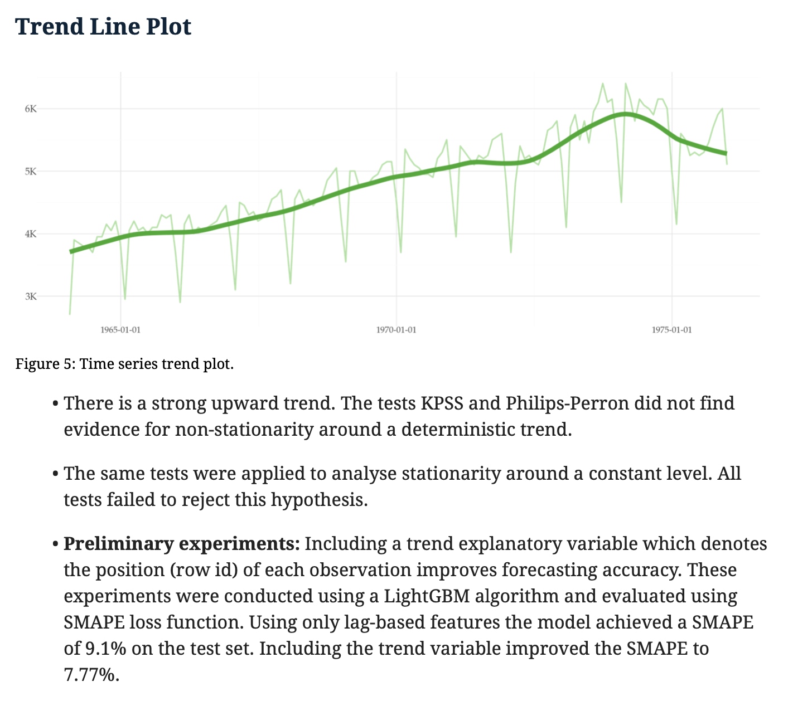
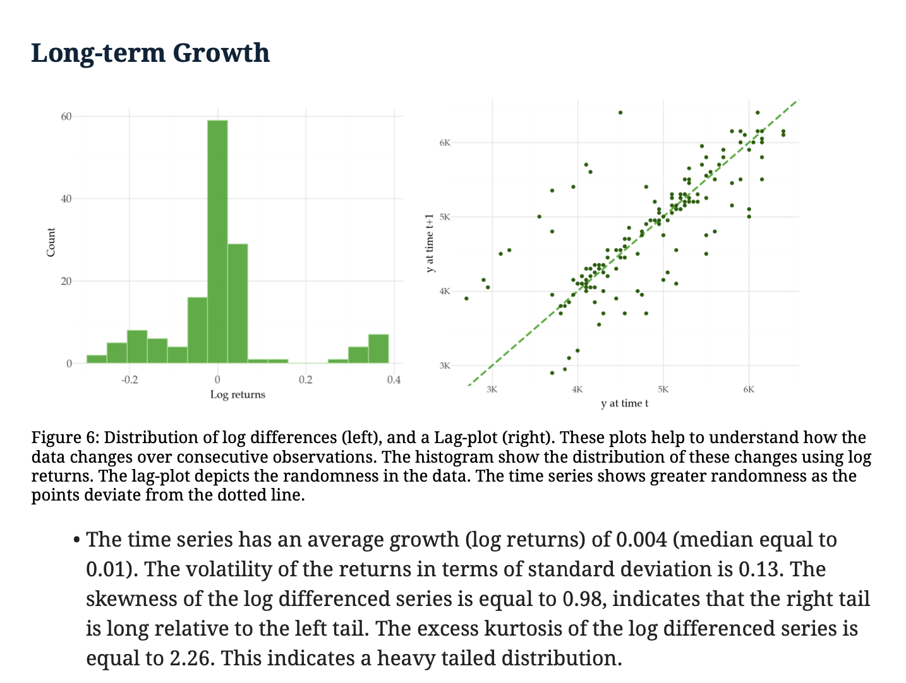
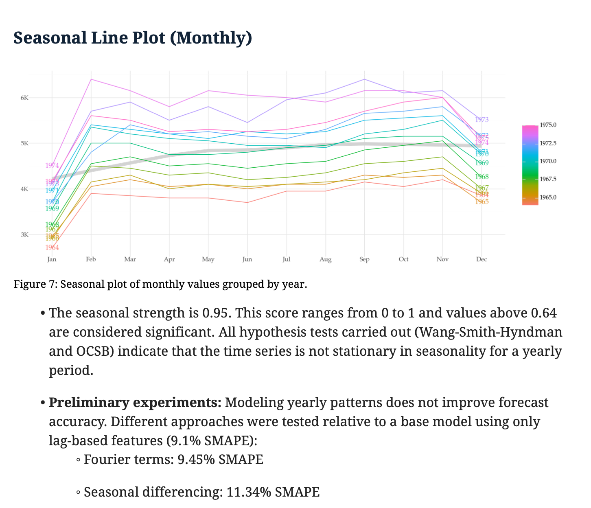
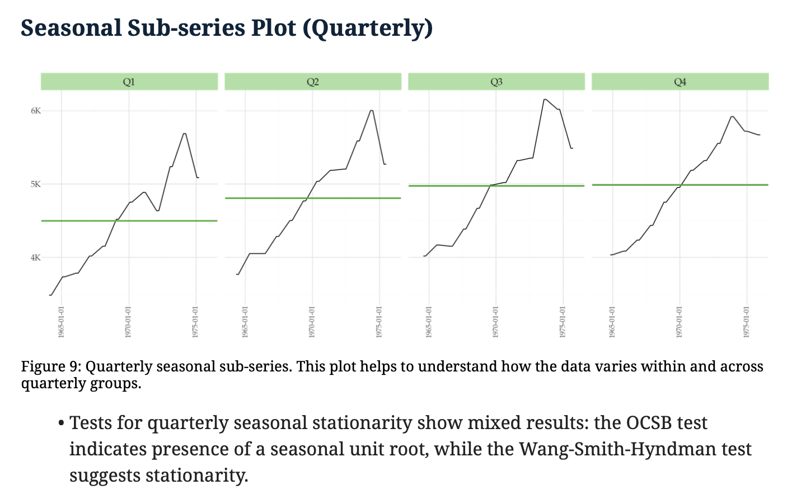
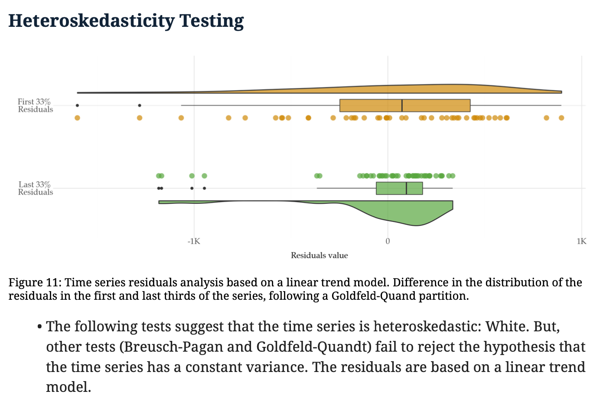
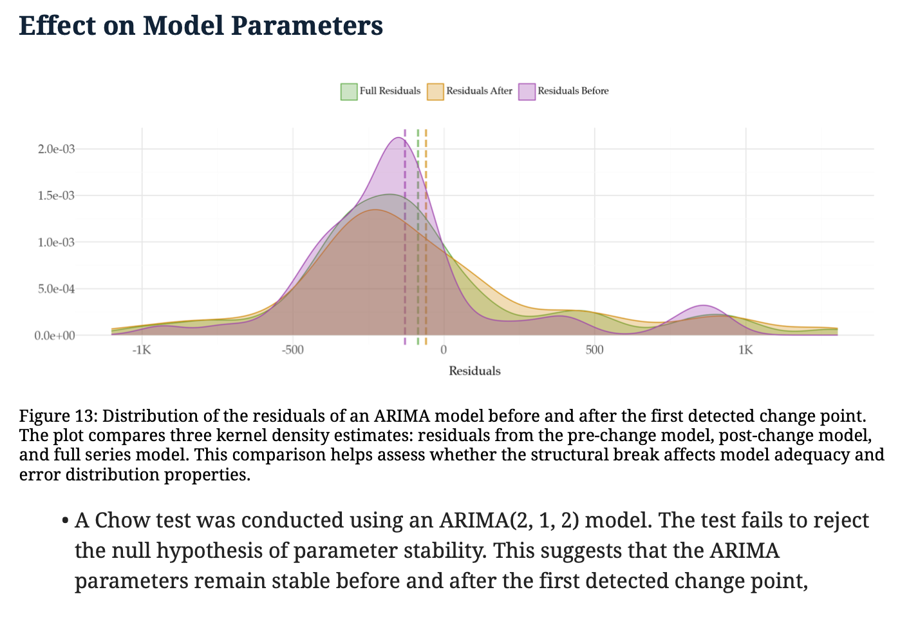

# cardtale


[](https://pypi.org/project/cardtale/)
[](https://github.com/vcerqueira/cardtale)
[](https://pepy.tech/project/cardtale)


**cardtale** is a Python package for generating automated model 
and data cards for time series, streamlining the documentation process 
for machine learning models and datasets.

### Key Features

- Automated generation of PDF reports with comprehensive time series analysis
- Built-in statistical analysis and visualization of temporal patterns
- Support for univariate time series data (will support other structures in future iterations)

Each time series is studied from multiple dimensions, including:
- **Data Overview**: Fundamental characteristics and statistical properties analysis
- **Trend Analysis**: Long-term growth patterns and level stabilization assessment
- **Seasonality Detection**: Multiple seasonality levels with strength metrics
- **Variance Analysis**: Heteroskedasticity testing and variance stabilization methods
- **Change Point Detection**: Identification of structural changes and regime shifts

## Basic Example

Here's a basic example of **cardtale**.

```python
from datasetsforecast.m3 import M3
from cardtale.cards.builder import CardsBuilder

df, *_ = M3.load('./assets', group='Monthly')

freq = 'ME'
uid = 'M1080'

series_df = df.query(f'unique_id=="{uid}"').reset_index(drop=True)

tcard = CardsBuilder(series_df, freq)
tcard.build_cards()
tcard.get_pdf(path='examples/cards/example.pdf')

```

### Screenshots













### **⚠️ WARNING**

> cardtale is in the early stages of development. 
> It is designed to cover datasets containing single univariate time series, focusing on forecasting tasks.
> 
> cardtale has been developed for monthly time series. So, the output for other frequencies may not be as reliable. 
> Especially time series with complex seasonality.
> 
> If you encounter any issues, please report
> them in [GitHub Issues](https://github.com/vcerqueira/cardtale/issues)


## Installation

### Prerequisites

Required dependencies:
```
arch==7.1.0
pandas==2.2.3
lightgbm==4.5.0
neuralforecast==1.7.5
mlforecast==0.13.4
statsforecast==1.7.8
datasetsforecast==0.0.8
numerize==0.12
plotnine==0.13.6
statsmodels==0.14.4
jinja2==3.1.4
ruptures==1.1.9
weasyprint==62.3
```


You can install **cardtale** using pip:

```bash
pip install cardtale
```

### [Optional] Installation from source

To install cardtale from source, clone the repository and run the following command:

```bash
git clone https://github.com/vcerqueira/cardtale
pip install -e cardtale
```

## License

Cardtale is released under the MIT License. See the [LICENSE](LICENSE) file for more details.

## Mission

In the machine learning lifecycle, 
proper documentation of models and datasets is crucial for transparency, 
reproducibility, and responsible AI practices. 
However, creating comprehensive model and data cards can be time-consuming. 
The Python package **cardtale** aims to partially automate this 
process, making it more efficient and consistent.

The goal of **cardtale** is to generate a set of analyses, 
visualizations, and interpretations based on input model 
metrics and dataset characteristics. 
While it doesn't replace the expertise of data scientists or 
domain experts, Cardtale speeds up the creation of model and 
data cards, guiding analysts towards key insights and 
areas that may require further exploration.